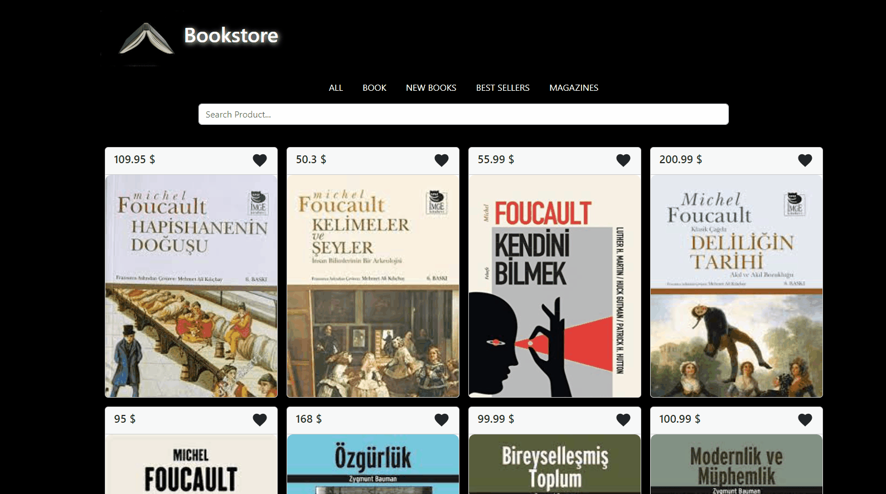

# Bookstore
This project is a website created using React, React-Bootstrap, React-icons, SASS. A simple React application for displaying a list of products in a bookstore.

## Screenshots
 

[Bookstore Live Page](https://bookstore-esma.netlify.app/)

## Tech/framework used
<b>Built with</b>  
 
 

## How to use?
Search for products 
Filter products by category 
Mark products as favorites 

## Description
In the project directory, you can run:
### `npm start`
Runs the app in the development mode.\
Open [http://localhost:3000](http://localhost:3000) to view it in your browser.

 
